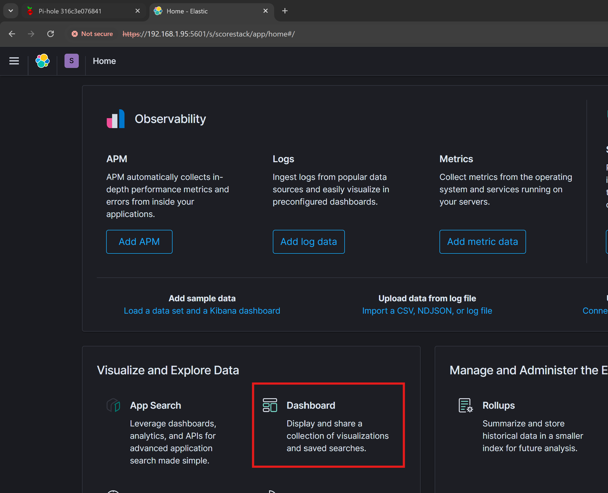
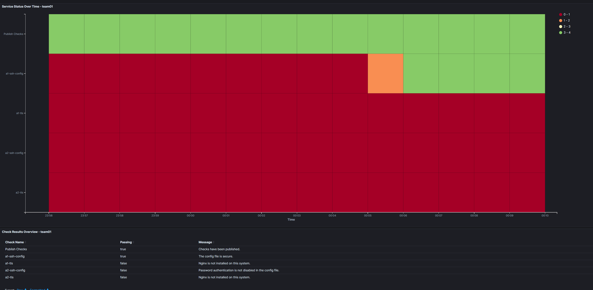

# CyberSeer
Welcome to CyberSeer! 

This is an agent-based automation scoring engine used for cybersecurity education to be used in tandem with hands-on practical labs, assignments, and experiences. The general premise is that the instructor defines a series of checks for various agents and defines what scripts these agents will run and get graded on.

>[!IMPORTANT]
> Nowhere in your check name (including the arguments!) can there be **any special characters**!
> 
> For instance, if you want to use a password in some SSH login command, then you can't supply the password with a `#`, `+`, spaces or other characters of the like!  
> 
> This messes up the MQTT topic the agents and the API read/publish to. 
> 
> This will be addressed in later patches, however version 1.0 has this current issue. Wanted to get this out ASAP.

# TLDR Installation Steps
1. Update the `~/Ansible/Agent-Initialization/roles/deploy-agent-service/files/start-agent.sh` file with the correct username on your machine. 
2. Update `inventory.yaml` to point to machines on your infrastructure. Update the variables as needed to access and deploy on your machines.
3. Run `./setup.sh` to deploy the entire scoring engine.
4. Go to `~/Automation/` and update `checks.csv`. Update to the desired checks and ensure the API and checks repo IP are accurate (otherwise, the agents won't get the right checks and won't publish anything).
5. Run `./upload-checks.sh`. Await for the Dynamicbeat PID to show up.
6. Navigate to `http://<API-Agent>:8081/admin`. You'll enter the password. Default `ScoreStack`. In here, you'll create the DNS entries for the various agents deployed in this scoring engine.
   1. For single-team deployments, the expected DNS requests are `1-X` where X is the name of the `target-agent` defined in this .csv. Have this resolve to the IP of the desired endpoint.

## Deployment Environment
The deployment shown below was tested on an environment with 4 separate Ubuntu 20.04.6 LTS (Focal Fossa) machines.

| Machine | IP | Role |
| --- | --- | --- |
| Manager |  192.168.1.95| Holds the ScoreStack GUI and DNS server |
| API | 192.168.2.249 | Holds the API, MQTT server, and Checks repo  |
| Agent 1 | 192.168.1.87 | Contains the agent |
| Agent 2 | 192.168.1.33 | Contains the agent |

### Step 1: Initialize Docker Swarm Manager Finished

### Step 2: Initialize Docker Swarm Worker Finished

### Step 3: Scoring Engine Infra Image Creation Finished

### Step 4a: Scorestack deployment note

*NOTE: If this step fails, then it's likely something that's wrong with the setup script that was changed by us. On average, it would take about 1.5 - 2 minutes. Each tick is 10 seconds by default.*

### Step 4b: Scoring Service Deployment Complete

The skipped task refers to an exit if the Kibana plugin doesn't exist.

### Step 5: Agent Initialization Complete

Congratulations! You now have deployed CyberSeer.

## Manual Modifications
> [!IMPORTANT]
> At this point, you have the base CyberSeer infrastructure. But, there are still some manual steps that need to be taken to get everything working. Again, 1.0 release takes precendence.

### Static DNS Entries
We need to add static DNS resolutions for the target agents to determine if the checks are for them. To do this, we can access the PiHole DNS website via `http://<manager IP>:8081/admin`. 

Login using the default credential `ScoreStack`.

>[!CAUTION]
Something interesting while deploying with the latest version of Pi-Hole via Docker [(GitHub Repo)](https://github.com/pi-hole/docker-pi-hole) relates to the login from the Web GUI. If you login multiple times, there is an error because of an existing cookie. To solve this, open an incognito or private window tab and login normally.

You'll be brought to this main homepage. Now, we can navigate to the `Settings -> Local DNS Records` to add custom DNS resolutions for the various agents.

Here, we can specify the names of the domains that will be queried by the agents to run checks for them.

In this example, we have `1-agent-1` and `1-agent-2` pointing to the IPs mentioned before. The naming convention comes from our check generator which will be discussed in the next section.

## Check creation
In the `Automation` Folder, you'll find a check generator that will create the checks for you based on the information in the `checks.csv` file. 

### Modify the API IP
You **must** modify the API IP to orient the agents to read from the correct checks and API repo. Multiple options allowed for future expansion and granularity for larger scoring engine deployments.

*Note: It is important to keep the first 9 lines where they are in the file. The check generator is hardcoded to read from the lines... sorry :)*

### Create the checks
Now, the moment we've all been waiting for - deploying the checks.

To do this, navigate to the `Automation` directory and simply `run ./upload-checks.sh`. This script will now create the checks and upload them to the manager containing ScoreStack. It will also kick off the checks.

Now, we can log into ScoreStack and watch the scoreboard populate. Default credentials are `elastic:changeme`.

Choose Scorestack

Choose `Dashboard`

Choose `Overview - team01` to view the dashboard.

And there it is. The scoreboard!

And down here hides the feedback for the students!

And this is how it looks once things change for the separate machines.

### Notes about the checks
We are laying the foundation for multi-team scorechecks. This could be for increased granularity and privacy of students scores or it could be for score checks for multiple sections of a class. This is future work. 

However, there is a formula for the **expected DNS name** that is generated from these checks that **needs to be reflected in the DNS server**.

For example, the check 

| target-agent| score-weight | target-script| run-method| arg-list | display-name |
| --- | --- | --- | --- | --- | --- |
| agent1 |10 | ssh-config |python3 | "" | a1-ssh-config |

Will result in the domain `1-agent1` being published. And so, the entry in the DNS server **MUST** match this domain for an agent to run this check and subsequently populate the corresponding *results* topic for this agent.

If looking into the main check-generator, you'll notice the variable {{.teamNum}} is appended to the topic. And so, it will be replaced with 1,2,3, etc...

The `Publish-Checks` is the thing that kicks off the entire scoring part. This is also a sanity check to ensure the agents are getting these checks and the scoring starts.

### Clearing the Checks
To clear the checks, we can simply run `ansible-playbook -i inventory.yaml Automation/Ansible/clear-scores.yml`. 

>[!IMPORTANT]
> This will delete all scores up to this point and stop the dynamicbeat process. Checks will be paused and the scoreboard will be cleared. Use with caution!

## Creating Additional Check Types
To create additional check types, all you need to do is make a simple Python script that the agents can run. Technically, the agents will construct a command to run from the checks themselves. For instance, `python3` will be the `run-method` and the the `target-script` will be put afterwards. And so it will be `<run-method> <target-script> <arg-list>` (e.g. python3 ssh-config).

To add them to the checks repo, you can either do it manually to the API docker container, or you can add them to the `~/Ansible/Deployment/docker/checks-repo/checks/` directory. Then go back to the main CyberSeer directory and run `./setup.sh redeploy` to remove the old scoring services and set them back up. Yes, this includes Scorestack. 

>[!NOTE]
> Remember to update your agent's virtual environment (pipenv) with the latest requirements for your new check!

# FAQ

## How to access Pi-Hole?
Navigate to `http://<API-IP>:8081/admin`. However, since we're on a Docker Swarm installation, you can use either the `swarm_manager` or the `swarm_worker` IP. The port remains the same.

# Troubleshooting
Since this is quite an extensive setup. There are numerous items that can break particularly with the manual steps. I'll try to help in debugging what some common runtime problems include.

### {"error": "No relevant message received or timed out"}
This means the API isn't able to read from the expected `results` topic from the agent. And so, this means the `agent` isn't publishing its checks. The most common error I made while making this is due to a mismatch between the manual DNS entry in the DNS server and expected DNS from the check definitions. This is described above. But the 

### Frozen at install Docker step
The `init_docker_service` role that is executed when deploying CyberSeer will try to install Docker using the `get.docker.com` bash script. If we run this script manually on a machine that already has `docker` and `docker compose` installed, then it will ask if you want to cancel to avoid any corruption.

If this happens, simply navigate to `~/Ansible/Deployment/roles/init_docker_service/tasks/main.yml` and comment out the `Install Docker` task. Then run the script again. Note this is applied to both the `swarm_manager` and `swarm_worker`.

# Contributions
We are more than willing to take contributions from the community. Our mission is to ensure that cybersecurity education becomes more practical and we don't have the perfect solution. Everyone has **something** they can contribute to this. We'll take ideas as well!

Feel free to submit a pull request or raise an issue!

# Research Article

Our research article: `Enhancing Cybersecurity Education using Scoring Engines: A Practical Approach to Hands-On Learning and Feedback` has been accepted for presentation at SIGCSE 2025.

You can find the abstract [here](https://sigcse2025.sigcse.org/details/sigcse-ts-2025-Papers/78/Enhancing-Cybersecurity-Education-using-Scoring-Engines-A-Practical-Approach-to-Hand)
